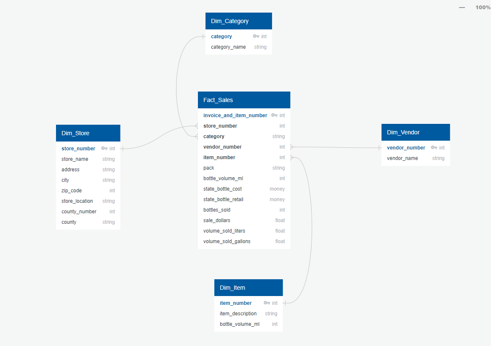
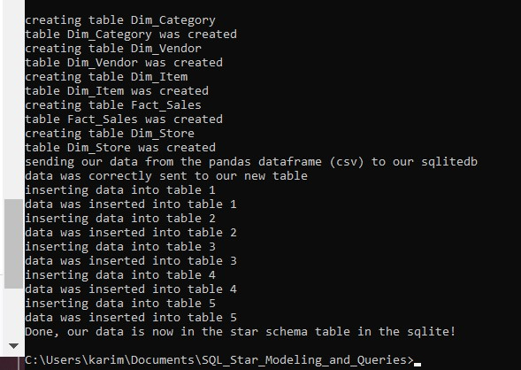

# SQL AND PYTHON - Normalizing Data
In this project we'll start with a CSV File that is just one denormalized table.
We'll analyze the table, create an ERD Diagram based in the star schema, 
create our queries in our sqlite database for our dimension and fact tables with sqlalchemy in python, 
and last we'll be inserting data from our csv (that was ingested as a new table in sqlite) 
to our Dim and Fact Tables.

## Star Schema ERD Diagram
</img>

## Logs from our application after it was ran:
</img>
